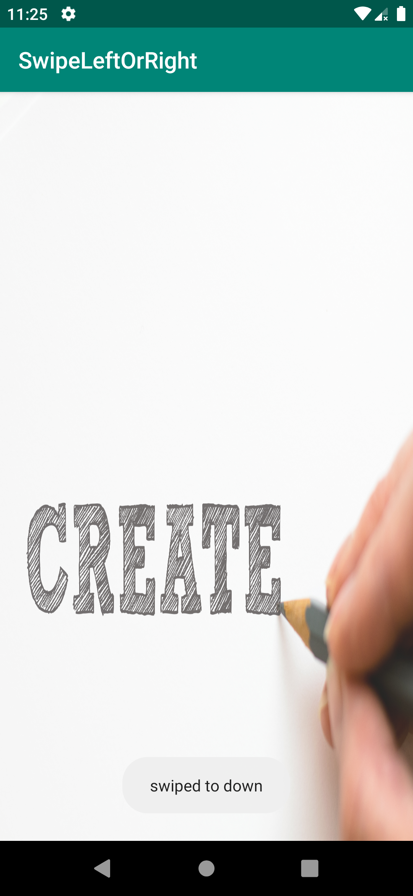

## **Android Swipe Gesture**

 This is an amazing gesture recognizer tool for android

You can easily recognize user gesture and handle it in your code


```
implementation 'com.github.Sagardevkota:SwipeLeftOrRight:v1.0'
```

## **Features**

* Swipe Left
* Swipe Right
* Swipe Up
* Swipe Down

## **Demo**



## **Methods**

```java

getGesture();
```

## **Integration guide**

First Initialize GestureDetector instance and pass the context(this) and instance of our class(which also requires context as an argument) as an argument.

```java

GestureDetector mGestureDetector = new GestureDetector(this, new swipe(getApplicationContext()));

```

## **Next Step**

Then add touch listener to your view where you want to handle user's gestures

```java

  Linearlayout myview=findViewById(R.id.my_view);
 //add listener to your view
   myview.setOnTouchListener(new View.OnTouchListener() {
            @Override
            public boolean onTouch(View view, MotionEvent motionEvent) {
              return false;
            }
        });


```

## **Override onTouchEvent method in your activity and check if the event was consumed or not**


     

```java
    @Override
    public boolean onTouchEvent(MotionEvent event)
    {
         //method onTouchEvent of GestureDetector class Analyzes the given motion event
        //and if applicable triggers the appropriate callbacks on the GestureDetector.OnGestureListener supplied.
        //Returns true if the GestureDetector.OnGestureListener consumed the event, else false.

        boolean eventConsumed=mGestureDetector.onTouchEvent(event);
        if (eventConsumed)
        {//get gesture
            String gesture= new swipe(getApplicationContext()).getGesture();
            Log.d("direction is" ,gesture);
          

            switch (gesture){

                case "left":
                  break;

                case "right":
                    break;

                case "down":
                    break;

                case "up":
                 break;
                           }
            return true;
        }
        else
            return false;
    }

    

```
   ## **License**

Copyright [2020] [Sagar Devkota]

Licensed under the Apache License, Version 2.0; you may not use this file except in compliance with the License. You may obtain a copy of the License at

 http://www.apache.org/licenses/LICENSE-2.0

Unless required by applicable law or agreed to in writing, software distributed under the License is distributed on an "AS IS" BASIS, WITHOUT WARRANTIES OR CONDITIONS OF ANY KIND, either express or implied. See the License for the specific language governing permissions and limitations under the License.


